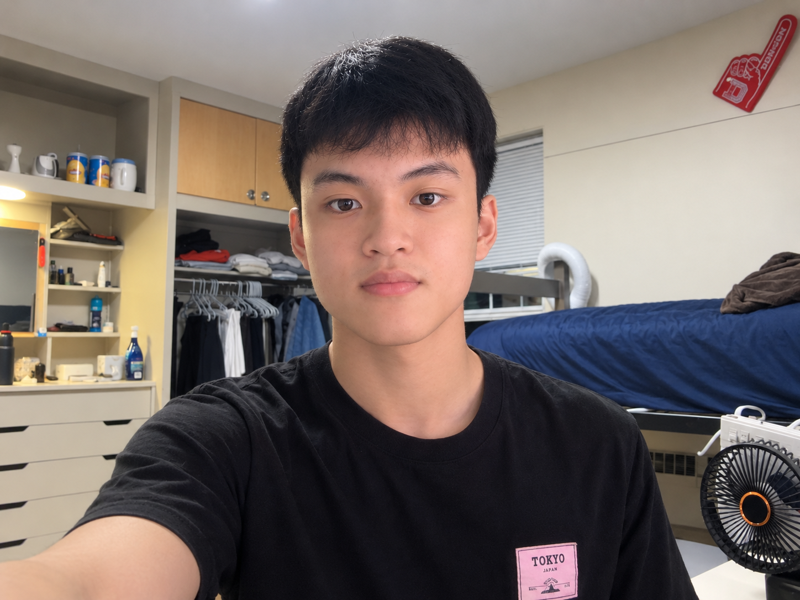
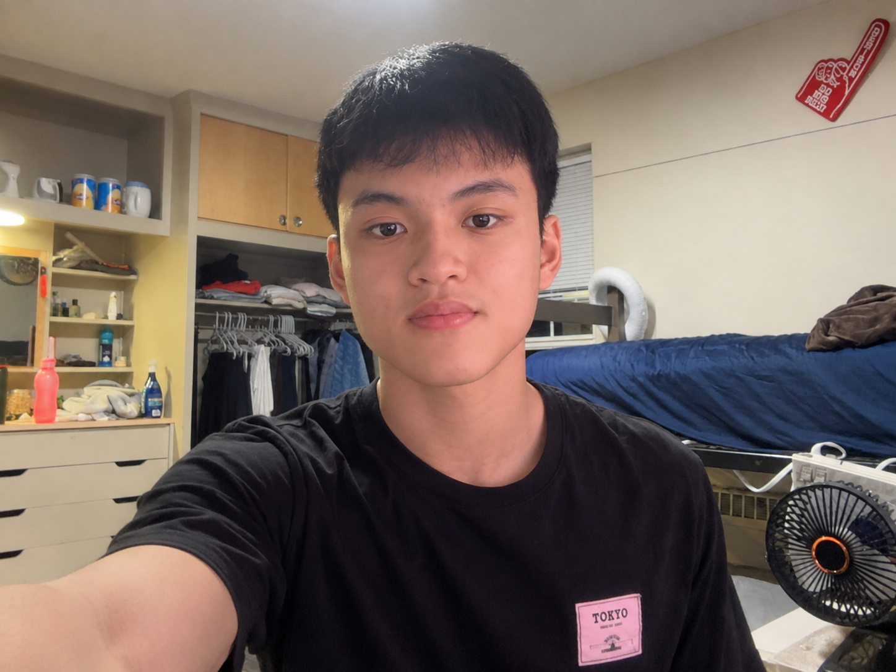

# Week 3 – Selfie & Identity

## The Artifact
Selfie & Identity
The generated image using ChatGPT: 
The modified image using Canva AI:     

## Process Notes
How did you make this?
Initially, I uploaded my photo to ChatGPT and ask for generating a selfie picture. After that, I use Canva AI to modify the image to be more natural, symmetrical, and balanced.

What tools did you use?
I use ChatGPT to generate a selfie image and Canva AI to modify the generated image to better version.

What decisions did you make?
I prompt Canva AI by telling specifically issues such as skin tone, background, light, ... in the generated image to produce better natural version of mine.

## Reflection
At first glance, all three images look like versions of the same person, but I see myself most clearly in the original photograph. The first image feels the most authentic because it captures how I actually looked in that moment, including the natural lighting, uneven skin tone, facial asymmetry, and imperfect composition. These details may not make the picture look “perfect,” but they are part of what makes the image feel like me. I can recognize my expression and the environment around me without feeling that anything has been intentionally corrected.
In the DALL-E version, I still see myself in the basic facial features, hairstyle, and expression, but I also notice things that feel less natural. My skin looks smoother and more even, and my face appears more symmetrical and polished. It looks like an improved version of me based on what AI thinks a good selfie should look like rather than exactly how I look. Because of that, I see myself physically, but not completely in terms of authenticity.
The Canva AI version feels closer to the original while still reflecting my request for improvement. The face remains recognizable, but the image has better balance, lighting, and composition. However, I still notice that some of the imperfections that make the original personal have been reduced.
This experience made me realize that AI does not simply reproduce my identity; it interprets it. When I asked AI to make the image “better,” I was also giving it permission to decide what “better” meant. I see myself in all three images, but the more AI changes, the more I have to decide which imperfections I am willing to keep because they are part of who I am.

## Attribution & AI Use
- AI Tool Used: DALL-E (via Chat GPT), Canva AI (via Canva)
- Prompt (summary): “Here is my original image taken from Photobooth on my Mac, I put this image on DALL-E to generate a selfie picture. The resulting image is perfect, nevertheless, I feel an uneven skin tone on my face, unnatural, lacking symmetry, and with flawed composition—reminiscent of an old photograph. I want to enhance this image based on my feedback.”
- AI Output: Generated a selfie portrait image with similar structural face and background.
- My Contribution: Generated a selfie image based on my photo using DALL-E, edited it in Canva, created a prompt about my feedback, reflection of DALL-E image for Canva AI to publish a second picture, which is better and satisfies my requirement. 