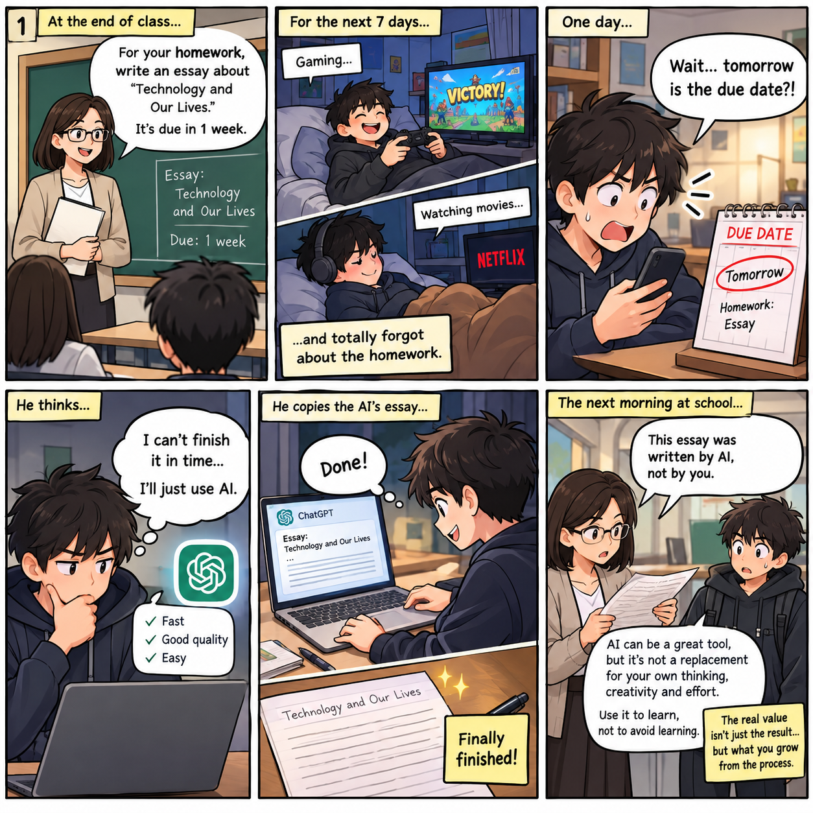

# Week 4 – Comic & Storytelling

## The Artifact
This six-panel comic tells the story of a student who procrastinates on an essay until the last minute and turns to AI for a quick solution. Although he successfully completes the assignment, his teacher recognizes that the essay was AI-generated and reminds him that AI should support learning rather than replace his own thinking, creativity, and effort.

## Process Notes
-How did you make this?

-What tools did you use?
I use Gemini to generate captions for 6 panels in the comic, use Dall-E to generate images, Canva to edit the images, and Google Docs to write the complete Make 3 project.

-What decisions did you make?

## Reflection
Respond to this week’s reflection prompt in 200–300 words.

## Attribution & AI Use
- Tools used: Gemini (caption for each panel in the comic), DALL·E (images).
- AI prompts (summary): Create a 5-6 panel comic strip with the following storyline: Panel 1: Class ends, and the teacher assigns a writing assignment with a one-week deadline. Panel 2: A student spends the entire week playing video games and watching movies instead of doing the homework. Panel 3: The student suddenly realizes that the deadline for the literature assignment is the very next day. Panel 4: Thinking he cannot finish it in time, he decides to use AI to complete the task. Panel 5: He diligently copies the AI-generated text into his assignment and is delighted when he finishes. Panel 6: Upon arriving at class, the teacher immediately recognizes that the essay was generated by AI and advises him to use AI for the right purposes. Select clear, exaggerated visual details based on the reference image and build the story around them, leading to a surprising, educational, and insightful conclusion. Keep the dialogue short, natural, and easy to read—avoiding anything random or confusing.
- What AI generated: AI generated 6 panels with dialogues for each.
- What you changed or decided: I idealize the story concept, define what is meaning of the comic, prompt, edit the image and generate the idea of dialogues for each panel.
