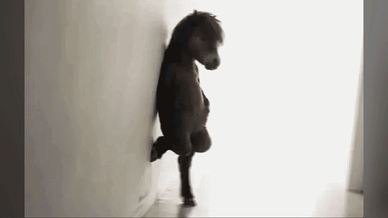

# Week 5 – GIF & Remix Culture

## The Artifact
The GIF is a short visual transition between two very different images. It begins with a dark, low-resolution image of a horse-headed figure standing against a bright wall. After about one second, the screen suddenly flares into an intense white light. The brightness expands across the image and briefly obscures everything. As the light fades, the first image is replaced by a clear outdoor photograph of two people standing beside a building. The GIF lasts approximately four seconds and creates a strong contrast between the strange, surreal first image and the realistic second image.

## Process Notes
How did you make this?
What tools did you use?
What decisions did you make?

## Reflection
When I think about how AI changes art, I don't see it as the death of creativity. Instead, it fundamentally redefines what it means to be an "author." For generations, being a creator meant picking up a brush, typing every line of text, or playing an instrument. Today, AI shifts our role from hands-on craftsman to something closer to a movie director or a curator. We set the vision, steer the ideas, and decide what is actually worth sharing, while a machine handles the execution.

This shift accelerates remix culture to a whole new level. Human culture has always built on what came before—think of hip-hop artists sampling old records or visual artists creating collages from magazines. But AI takes that concept and speeds it up exponentially. Every time a model generates an image or a paragraph, it is instantly synthesizing millions of tiny fragments of human expression from across the internet into a single output. It is essentially hyper-remixing our collective history in seconds.

Because of that, the question of who owns AI-made art becomes extremely messy. Personally, I don't think any single person can claim complete ownership. A short prompt on its own doesn't feel like enough to make someone the sole author, but the computer certainly doesn't "own" anything either. More importantly, none of this would exist without the work of millions of human artists whose creations were used to train these systems. To me, AI art lands in a weird middle ground: it feels less like private property and more like a shared, algorithmic echo of our collective culture.

## Attribution & AI Use
- Tools used: VEED (Video Generate Plugin on ChatGPT), EZGIF (transform from video to gif)
- AI prompts (summary): Generate a short video around 4 second combine these two images by a transition that flared up brightly, then subsided
- What AI generated: A short 4 second video satisfied my requirements
- What you changed or decided: I took a photo of mine, selected another image on the Internet and then prompted AI to combine these 2 images into one video, then I put the video to EZGIF to generate a .gif file.
